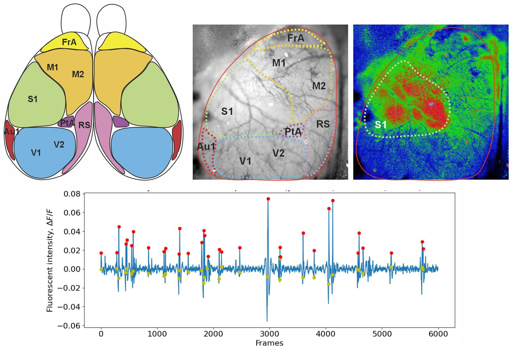

# NMF-ROI Calcium Analysis

## Overview

Calcium imaging data can be analyzed using different strategies depending on the scientific question and assumptions about the data. This project combines two complementary pipelines:

## NMF-based pipeline
- Data-driven approach using Non-negative Matrix Factorization (NMF)
- Extracts spatial and temporal components directly from imaging data
- Implemented as a sequence of modular Jupyter notebooks

## ROI-based pipeline
- Hypothesis-driven approach using predefined regions of interest (ROIs)
- Implemented using a structured, class-based design

## Getting Started

Choose one of the two pipelines depending on your preferred analysis method:

Run NMF-based analysis
See: nmf_pipeline/README.md

Run ROI-based analysis
See: roi_pipeline/README.md
